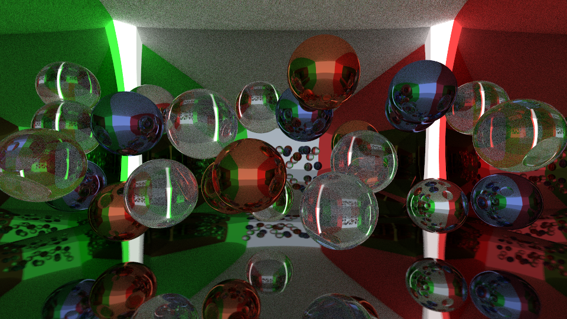

# GoTracing101

Simple path tracer written in Golang, mostly for learning pusposes.

Interruption (Ctrl+C) will stop rendering, but rendered part of image will be saved.

### Command line flags:

**-width=960 -height=540**  extents of resulting image

**-spp=64**         samples per pixel

**-bounces=32**     maximum bounces per ray

-**objnum=24**      number of objects (small spheres) at test scene

**-filename=out**   out file name without extension

